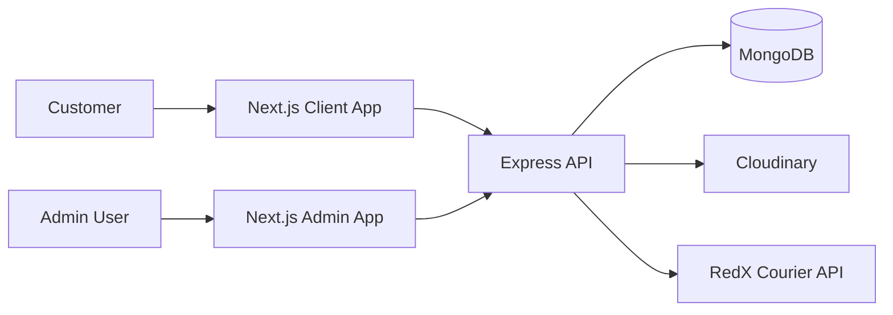
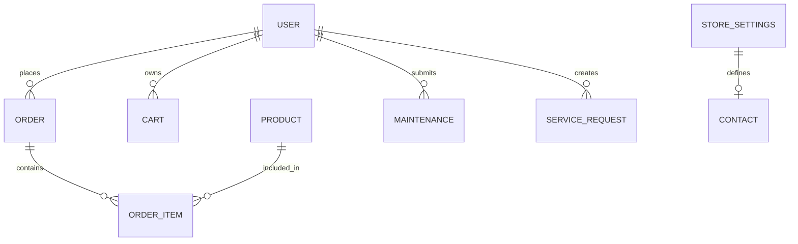

# 🛒 Drone Bangladesh

Drone Bangladesh is a full-stack e-commerce and service platform for drone and handheld products, built as a multi-app Next.js + Node.js project with a MongoDB-backed API. The storefront lets customers browse products, manage a cart and wishlist, create accounts, place orders, track order status, and book maintenance services, while the admin app provides product, order, homepage, customer, and support management tools.

### Project links
- [Client storefront](https://drone-bangladesh-client.vercel.app/)
- [Admin dashboard](https://admin-drone-bangladesh.vercel.app/)
- [GitHub Link](server)

---

# ✨ Key Features

### Customer Features
- Product catalog browsing for drones and handheld devices with category and filter-based discovery
- Product detail pages with pricing, images, and related items
- Cart and wishlist management for authenticated and guest users
- User registration, login, and profile management with JWT-based session handling
- Order creation with customer details, shipping address, pricing, coupon validation, and order tracking
- Maintenance service booking flow for drone repair and calibration requests
- Contact form submissions for website inquiries
- Public product and homepage content loaded from database-driven sections

### Admin Features
- Admin login with role-based access checks
- Dashboard summary for product, order, customer, banner, and maintenance metrics
- Product management for drone inventory including create, update, bulk update, and delete operations
- Homepage management for featured categories, product flag sections, and honorable customer listings
- Order management with status updates, search, filtering, and courier integration
- Customer management with account listing, deletion, and freeze/unfreeze actions
- Contact inquiry management with status updates and statistics
- Maintenance administration for service jobs and service request tracking
- Coupon management and store settings management

### Other Features
- Cloudinary-based image uploads for avatars, banners, and customer/media content
- MongoDB-based persistence for catalog, user, order, and support data
- CORS protection with explicit allowed origins
- RedX courier API integration for parcel dispatch workflow

---

# 🧩 Technology Stack

| Category | Technology | Role in this project |
|---|---|---|
| Frontend | Next.js 16 + React 19 | Customer storefront and admin application UI |
| Styling | Tailwind CSS | Visual design and responsive layout across client and admin apps |
| Backend | Node.js + Express | REST API, authentication, order logic, admin operations |
| Database | MongoDB | Persistence for products, users, orders, coupons, maintenance, settings, and CMS content |
| Authentication | JWT + bcryptjs | User authentication, admin authorization, and password protection |
| Image Storage | Cloudinary | Upload and serve images for product and content management |
| Courier Integration | RedX API | Send confirmed orders to a delivery partner |
| Data Serialization | JSON API responses | Standardized success/error payloads across routes |
| Client-side helpers | Axios, native fetch | Frontend API access and token handling |

---

# 🏗️ Application Architecture

This repository is split into three connected applications:

- The customer-facing frontend in [client](client)
- The admin dashboard in [admin](admin)
- The backend API in [server](server)



The data flow is straightforward: the client and admin apps consume the Express API over HTTP, attach JWT tokens for protected routes, and store application data in MongoDB collections. Public catalog content and homepage sections are exposed without authentication, while admin and user-specific actions require token validation and role checks.

---

# 🔐 Authentication & Security

The codebase implements a practical set of security controls that are visible in the actual project structure:

- JWT authentication is used to verify user sessions. The backend reads the Bearer token from the Authorization header and verifies it with `JWT_SECRET` in [server/src/middleware/authMiddleware.js](server/src/middleware/authMiddleware.js).
- Passwords are stored as bcrypt hashes, not plain text. The registration and login flow in [server/src/controllers/authController.js](server/src/controllers/authController.js) uses `bcryptjs` before inserting or validating a password.
- Admin authorization is enforced through the `verifyAdmin` middleware. Routes in the server use `verifyToken` and `verifyAdmin` before product, order, homepage, and maintenance management actions are allowed.
- CORS is configured in [server/server.js](server/server.js) with an explicit origin allowlist for local development, Vercel domains, and configured environment origins.
- Protected routes require authentication for cart, wishlist, order history, and profile operations.
- Request validation is implemented throughout the API for required fields, invalid IDs, invalid status values, and invalid coupon data.
- Form submissions for contact and maintenance requests validate required inputs before storing records.
- Cloudinary uploads are used for image assets and profile uploads rather than arbitrary local file storage.
- The server also includes security headers in [server/vercel.json](server/vercel.json) such as `X-Content-Type-Options`, `X-Frame-Options`, and `Referrer-Policy`.

This is a real implementation, but it is not a claim of blanket “enterprise security.” The code clearly includes token-based auth, password hashing, role checks, and origin restrictions, while the repository does not include a full payment gateway, advanced rate limiting layer, or audit logging system.

---

# 🔄 Main Application Flow

### Customer purchase flow
1. The user browses the homepage and product categories.
2. Product filtering and search data is loaded from the MongoDB-backed public API.
3. The customer adds items to the cart or wishlist and can proceed to checkout.
4. Checkout accepts customer, address, pricing, and payment method details and creates an order document.
5. Order status can be tracked through the customer order-tracking page using the saved order ID and account data.

### Maintenance and support flow
1. A customer opens the maintenance page and submits a service request with drone details and selected package.
2. The public API stores the service request and lets admin users review and update it.
3. Admin users can change maintenance statuses, assign technicians, and track service progress.

### Admin workflow
1. Admin signs in to the dashboard.
2. Admin manages products, homepage promotions, customer records, store settings, and service leads.
3. Orders and maintenance work are updated through the admin console and reflected in the public app data.

---

# 👥 User Roles

| Role | Main Capabilities |
|---|---|
| Customer | Register/login, manage profile, browse products, add to cart/wishlist, place orders, track orders, submit maintenance requests |
| Admin | Manage app content, products, homepage sections, orders, customers, settings, maintenance jobs, contact submissions, coupons |

The codebase stores a `role` field on each user record and checks it in the auth middleware before allowing administrative actions.

---

# 🔌 API Overview

The backend exposes a REST API from [server/server.js](server/server.js). The most important routes are shown below.

| Method | Endpoint | Purpose | Access |
|---|---|---|---|
| POST | /api/auth/register | Create a customer account | Public |
| POST | /api/auth/login | Authenticate a user and return a JWT | Public |
| GET | /api/auth/me | Fetch the logged-in user | Authenticated |
| PUT | /api/auth/me | Update profile or password | Authenticated |
| GET | /api/products | Get catalog products with search, filters, sort, and pagination | Public |
| GET | /api/products/:id | Fetch one product | Public |
| POST | /api/orders | Create a new order | Public |
| GET | /api/orders/mine | List orders for the logged-in user | Authenticated |
| GET | /api/orders/mine/:orderId | Fetch one order by order ID for the logged-in user | Authenticated |
| POST | /api/coupons/validate | Validate discount code | Public |
| GET | /api/maintenance/page-content | Get public maintenance page meta content | Public |
| POST | /api/maintenance/service-requests | Submit service request | Public |
| GET | /api/client/homepage/featured-categories | Fetch homepage category cards | Public |
| GET | /api/client/drones/categories | Fetch drone category groups | Public |
| GET | /api/client/handhelds/categories | Fetch handheld category groups | Public |
| GET | /api/v1/admin/products | List admin products | Admin |
| POST | /api/v1/admin/products | Create product | Admin |
| GET | /api/v1/admin/orders | List all orders | Admin |
| PATCH | /api/v1/admin/orders/:id/status | Update order status | Admin |
| GET | /api/v1/admin/contact | Fetch contact submissions | Admin |
| GET | /api/v1/admin/homepage/featured-categories | Fetch homepage featured category config | Admin |
| GET | /api/v1/admin/maintenance/service-requests | View service requests | Admin |

---

# 🗄️ Database Design

The server uses MongoDB with document-oriented collections rather than a relational schema. The most important collections and patterns visible in the code are:

- `users`: stores customer/admin records, password hash, role, active status, cart, and wishlist
- `products`: product catalog and pricing fields; there are also dedicated `Drones` and `handhelds` collections used in some catalog flows
- `orders`: stores customer information, shipping/billing addresses, pricing breakdown, item snapshots, payment method, and delivery status
- `coupons`: discount codes with validity and amount controls
- `maintenance`: internal repair and service job tracking
- `service_requests`: customer maintenance booking leads submitted from the public site
- `settings`: store-wide contact and business information
- `contact_submissions`: website contact form data
- `banners`, `categories`, `honorableCustomers`: homepage/content management records



This is a document-based system, so the “relationships” are mostly embedded objects and arrays rather than strictly normalized relational tables. For example, an order stores nested item data and customer details directly in the order document, which is a common pattern for a MongoDB commerce application.

---

# 🧠 Engineering Highlights

- Multi-app architecture: the storefront, admin console, and API are intentionally separated, which keeps the customer-facing experience and admin operations distinct while sharing the same backend services.
- JWT + middleware-based authorization: route protection is centralized in the express middleware, making the project easier to reason about and extend for new admin or customer operations.
- MongoDB document design: the app stores nested order, profile, and maintenance data directly in document records, which matches the repository’s query and update patterns without adding a separate ORM layer.
- Public/private API split: public endpoints handle product catalog, homepage content, and service requests, while authenticated and admin-protected routes manage sensitive user and business operations.
- Dynamic CMS and content management: banner, homepage, and featured category data are stored in MongoDB and managed through admin endpoints, which keeps promotional content editable without code changes.
- Order and delivery workflow: the system supports order status updates, customer tracking, and RedX courier integration in a single operational flow.
- File management via Cloudinary: product/media and profile content can be uploaded using base64 image input and stored in the cloud instead of local filesystem storage.

---

# 📁 Project Structure

```text
Drone Bangladesh/
├── README.md
├── package.json
├── server/
│   ├── server.js
│   ├── vercel.json
│   ├── src/
│   │   ├── config/
│   │   ├── controllers/
│   │   ├── middleware/
│   │   ├── models/
│   │   ├── routes/
│   │   └── utils/
│   └── .env.example
├── client/
│   ├── src/
│   ├── next.config.mjs
│   ├── package.json
│   └── .env.example
├── admin/
│   ├── src/
│   ├── next.config.mjs
│   ├── package.json
│   └── .env.local
└── ...
```

This is a monorepo-like structure without a root-level application command; the three apps operate independently and are run separately using their own package scripts.

---


# 🚀 Deployment

The backend includes a Vercel deployment configuration in [server/vercel.json](server/vercel.json), which is the clearest deployment-related artifact in the repository. The client and admin apps are standard Next.js applications and are configured for deployment in a typical Vercel or similar hosting environment.

The repo does not include a custom Docker deployment, CI pipeline, or a centralized production deployment script beyond the app-specific Next.js and Vercel configuration, so deployment should be treated as separate environment setup for each app.

---

# 🔮 Future Improvements

The following are realistic next-step improvements for this project, but they are not currently implemented in the repository:

- Add automated tests for the Express API and key app flows
- Introduce a real online payment gateway such as SSLCommerz, Stripe, bKash, Nagad, or similar provider integration
- Add monitoring, logging, and health checks for production observability
- Improve API validation and request rate limiting for higher traffic environments
- Add CI/CD automation and deployment checks for client, admin, and API releases

---

# 📌 Important Notes

- This project is intentionally structured as three independent apps: a storefront, an admin dashboard, and an API server.
- The checkout flow includes payment method options such as Cash on Delivery, bKash, Nagad, Visa, Mastercard, and Rocket in the UI, but the repository does not include an active card or wallet payment processor implementation.
- RedX courier integration is implemented as an external API call, but it still depends on valid environment configuration and external credentials.
- No demo login credentials are stored in the repository, so the admin user must be created or seeded using the implementation in the backend scripts.
- The repository does not contain automated tests or a formal QA suite.

---

# 👨‍💻 Developer

This project was developed by **Ferdaws Alif**, a Full-Stack MERN Developer.

### Connect with me

- 🌐 Portfolio: https://ferdaws-alif-dev.vercel.app/
- 💻 GitHub: https://github.com/ferdaws-ahmed
- 💼 LinkedIn: [https://www.linkedin.com/in/md-ferdaws/]

For project inquiries, freelance work, or collaboration, feel free to get in touch.

---

This project demonstrates a realistic e-commerce workflow with product management, admin operations, order handling, maintenance services, and a document-based backend architecture. It is a strong example of a full-stack commerce implementation built around Next.js, Express, and MongoDB, with direct evidence of code-level engineering decisions in the repository itself.
# drone-bangladesh
